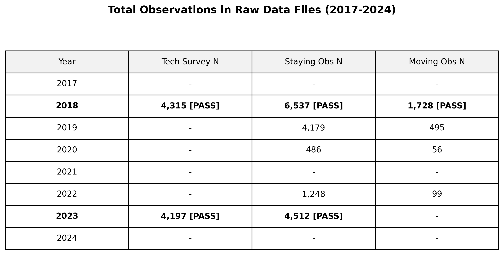

# Seattle Urban Vitality & Digital Equity Index
**An intersectional analysis of residential digital infrastructure and public space behavior.**

## 📌 Project Overview
Does a neighborhood's lack of reliable home internet change how its public spaces are used? This project investigates whether residents **externalize** digital activities into public spaces when private infrastructure fails—a phenomenon known as the **"Digital Lifeboat" effect**.

Unlike traditional research that begins with a hypothesis and seeks data to match, this project utilized a **"Data-First" Discovery Process**. By auditing and harmonizing longitudinal Open Data from the City of Seattle, I identified a unique intersection between digital equity surveys and behavioral urban observations to test how infrastructure reliability (not just access) drives public behavior.

🎯 **Primary Research Question**
> *“Does low residential internet reliability lead individuals to externalize digital activities into public spaces, increasing digital-to-social activity ratios, independent of neighborhood income?”*

## 💡 Hypotheses & Key Findings
* **H1 (Substitution):** Lower home reliability correlates with higher public **Digital-to-Social Ratios (DSR)**.
    * ✅ **Result:** Confirmed. In controlled OLS models, internet reliability was a significant predictor (**$p=0.02$**) of DSR.
* **H2 (Independence):** This effect persists even when controlling for median income.
    * ✅ **Result:** Confirmed. The "Reliability Gap" in public behavior remains significant regardless of neighborhood wealth.
* **H3 (Intensity):** The digital reliance on public space shifted post-pandemic (2023 vs 2018).
    * 🟡 **Result:** Mixed. While coefficients shifted, Mixed-Effects modeling indicates high neighborhood-specific variance (**$Group Var = 0.35$**).

## 📊 The Data & Analytical Pivot
Data was sourced from the [Seattle Open Data Portal](https://data.seattle.gov/) and supplemented with city-provided ZIP Code GeoJSONs. Detailed documentation on source URLs and codebook mapping is available in [`data/README.md`](data/README.md).

### Why "Staying" over "Moving"?
A critical methodological pivot was made to focus exclusively on the `staying.csv` dataset rather than `moving.csv` (pedestrian flow):
1. **Observation Depth:** `staying.csv` contains rich activity markers (e.g., electronic device usage vs. socializing) and perceived demographic attributes.
2. **Temporal Alignment:** Staying observations provided the most robust longitudinal overlap with the 2018 and 2023 Tech Surveys.
3. **Intentionality:** DSR is a proxy for how a space is *used*, whereas flow counts are subject to external traffic biases.
4. **Data Sparsity (Moving):** An audit of the `moving.csv` dataset revealed zero observations for 2023 and fewer than 100 for 2022, precluding a longitudinal flow analysis.



## 🧪 Methodological Assumptions & Rigor

### The "Locality" Assumption
A central pillar of this analysis—and a common city planning assumption—is that **observed users in a neighborhood plaza are likely residents of that ZIP code.** While destination parks attract city-wide visitors, neighborhood plazas serve as "Third Spaces" for the local community. Therefore, we treat residential ZIP code data as a valid proxy for the environmental pressures facing users in those spaces.

### Temporal Lumping (Era Proxies)
To maintain longitudinal rigor, datasets were "lumped" into two distinct eras:
* **Pre-Pandemic:** 2018 Survey data + 2018/2019 Observation data.
* **Post-Pandemic:** 2023 Survey data + 2022/2023 Observation data.
* *Assumption:* Behavior within these year-pairs remained stable enough to act as proxies for their respective eras.

### Income & Schema Harmonization
* **Categorical Mapping:** Income buckets and ethnicity codes were consolidated across the 5-year gap to ensure 1:1 comparability.
* **Bias Acknowledgment:** Without further analysis, we cannot determine if survey respondents were perfectly representative of their ZIP codes. Future work with larger N-sizes and ACS (Census) validation is needed to account for potential non-response biases.

## 🏗️ Repository Structure
```plaintext
seattle-public-life-analysis/
├── data/
│   ├── raw/             # Original CSVs (Immutable)
│   ├── processed/       # master_vitality_index.csv (40+ feature index)
├── scripts/
│   ├── 02b_standardize_surveys.py  # Longitudinal schema mapping
│   ├── 03_merge_data.py            # ZIP-level aggregation & weather join
│   ├── 05_statistical_modeling.py  # OLS & Mixed-Effects implementations
└── requirements.txt